[](http://quantlet.de/index.php?p=info)

## [](http://quantlet.de/) **XFGCopula_stock** [](http://quantlet.de/d3/ia)

```yaml


Name of QuantLet: XFGCopula_stock

Published in: GitHub

Description: 'Uses four types of copula (Gaussian, t, Clayton and Gumbel) to fit returns of 
10 Internet and Software stocks in S&P500 (time period: 2015/05/01-2016/04/25), computes the 
Kendall''s tau, Spearman''s rho and tail dependence matrix of corresponding estimated copula. 
Simulates these four types of copula and creates contour plot, perspective plot and scatter 
plot for each copula. Estimates a portfolio VaR using simulated Gaussian Copula.'

Keywords: copula, Gaussian, Student t, Clayton, Gumbel

Author: Jinhua Yang

Datafile: stock10.csv

Input: Prices of 10 Internet and Software stocks in S&P500 (time period: 2015/05/01-2016/04/25)

Output: 'Kendall''s tau, Spearman''s rho and tail dependence matrix 
        contour plot, perspective plot and scatter plot for each simulated copula'

```
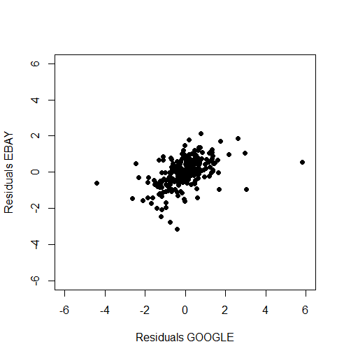 
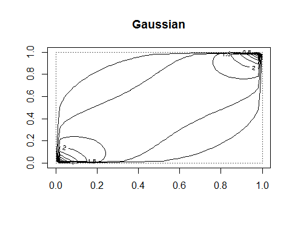      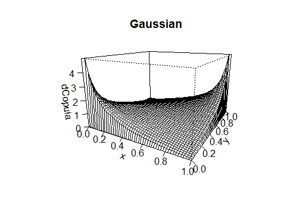     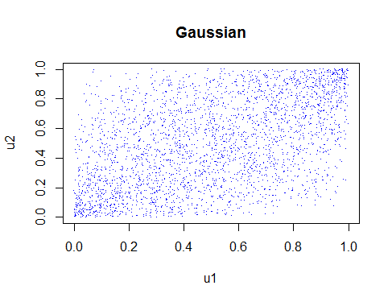
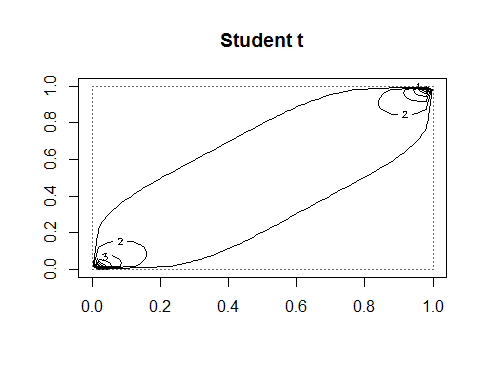     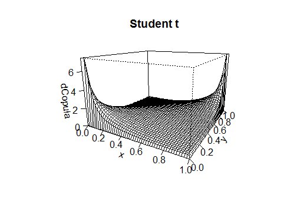    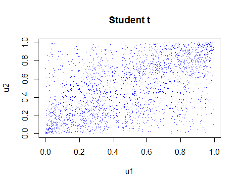
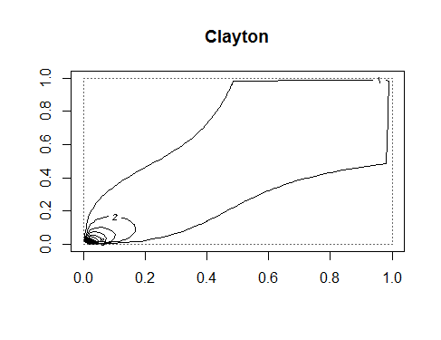       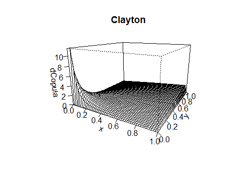      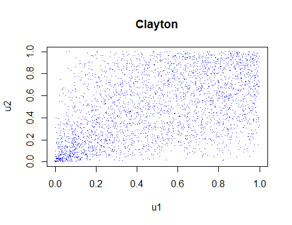
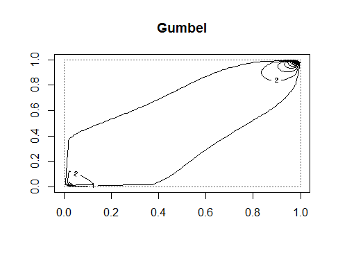        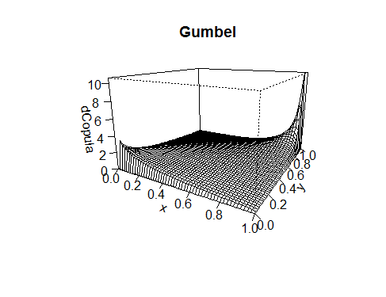       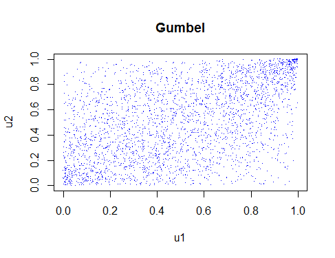


```r

# clear history
rm(list = ls(all = TRUE))
graphics.off()

# setwd('D:...') set working directory

# Install packages if not installed
libraries = c("tseries", "VineCopula", "copula", "matrixStats")
lapply(libraries, function(x) if (!(x %in% installed.packages())) {
    install.packages(x)
})

# Load packages
lapply(libraries, library, quietly = TRUE, character.only = TRUE)

# import data
stock = read.csv("stock10.csv", header = T, sep = ",")

# get daily return of each stock
price = stock[, 2:11]
T = nrow(price)
n = ncol(price)
value = matrix(stock[, 12], nrow = T)
return = log(price[2, ]/price[1, ])
for (j in 2:(T - 1)) {
    return[j, ] = log(price[j + 1, ]/price[j, ])
}
T = nrow(return)
W = matrix(unlist(price[1, ]/value[1, ]), nrow = n, ncol = 1)

# standardization
return = as.matrix(return)
mean = as.matrix(colMeans(return))
mean = t((mean[, 1]))
meanmatrix = matrix(rep(mean, T), ncol = ncol(mean), byrow = TRUE)
demean = return - meanmatrix

std = matrix(rep(0), nrow = T, ncol = 10)
for (i in 1:10) {
    value = fitted.values(garch(demean[, i], order = c(1, 1), series = NULL))
    std[, i] = value[, 1]
}

residuals = demean[2:247, ]/std[2:247, ]

rmean = as.matrix(colMeans(residuals))
rstd = as.matrix(colSds(residuals))


# correlation parameter estimates(rho) using Gaussian Copula

normrho = matrix(rep(0), nrow = 10, ncol = 10)

for (i in 1:10) {
    normrho[i, i] = 1
    for (j in (i + 1):10) {
        # empitical cdf
        u = pobs(cbind(residuals[, i], residuals[, j]))
        # esimating normal copula
        set.seed(10)
        normfit = fitCopula(normalCopula(dim = 2), u, method = "ml")
        normrho[i, j] = unname(coef(normfit))
        normrho[j, i] = normrho[i, j]
    }
}
normrho1 = c(normrho[1, 2:10], normrho[2, 3:10], normrho[3, 4:10], normrho[4, 5:10], normrho[5, 
    6:10], normrho[6, 7:10], normrho[7, 8:10], normrho[8, 9:10], normrho[9, 10])

# correlation parameter estimates(rho and df) using T Copula

trho = matrix(rep(0), nrow = 10, ncol = 10)
tdf = matrix(rep(0), nrow = 10, ncol = 10)

for (i in 1:10) {
    trho[i, i] = 1
    for (j in (i + 1):10) {
        # empitical cdf
        u = pobs(cbind(residuals[, i], residuals[, j]))
        # esitmating t copula
        set.seed(10)
        tfit = fitCopula(tCopula(dim = 2), u, method = "ml")
        trho[i, j] = unname(coef(tfit)[1])
        tdf[i, j] = unname(coef(tfit)[2])
        trho[j, i] = trho[i, j]
        
    }
}

# correlation parameter estimates(delta and Kendall¡¯s tau) using Clayton Copula

delta_clay = matrix(rep(0), nrow = 10, ncol = 10)
tau_clay = matrix(rep(0), nrow = 10, ncol = 10)
tail_Lower = matrix(rep(0), nrow = 10, ncol = 10)

for (i in 1:10) {
    delta_clay[i, i] = 999
    tau_clay[i, i] = 1
    tail_Lower[i, i] = 1
    for (j in (i + 1):10) {
        # empitical cdf
        u = pobs(cbind(residuals[, i], residuals[, j]))
        # esitmating clayton copula
        set.seed(10)
        clayfit = fitCopula(claytonCopula(dim = 2), u, method = "ml")
        
        delta_clay[i, j] = unname(coef(clayfit))
        delta_clay[j, i] = delta_clay[i, j]
        
        tau_clay[i, j] = delta_clay[i, j]/(delta_clay[i, j] + 2)
        tau_clay[j, i] = tau_clay[i, j]
        
        tail_Lower[i, j] = 2^(-1/delta_clay[i, j])
        tail_Lower[j, i] = tail_Lower[i, j]
        
    }
}

# correlation parameter estimates(delta and Kendall¡¯s tau) using Gumbel Copula

delta_gum = matrix(rep(0), nrow = 10, ncol = 10)
tau_gum = matrix(rep(0), nrow = 10, ncol = 10)
tail_upper = matrix(rep(0), nrow = 10, ncol = 10)

for (i in 1:10) {
    delta_gum[i, i] = 999
    tau_gum[i, i] = 1
    tail_upper[i, i] = 1
    for (j in (i + 1):10) {
        # empitical cdf
        u = pobs(cbind(residuals[, i], residuals[, j]))
        # esitmating clayton copula
        set.seed(10)
        gumfit = fitCopula(gumbelCopula(dim = 2), u, method = "ml")
        
        delta_gum[i, j] = unname(coef(gumfit))
        delta_gum[j, i] = delta_gum[i, j]
        
        tau_gum[i, j] = 1 - 1/delta_gum[i, j]
        tau_gum[j, i] = tau_gum[i, j]
        
        tail_upper[i, j] = 2 - 2^(1/delta_gum[i, j])
        tail_upper[j, i] = tail_upper[i, j]
        
    }
}

# copula simulation

plot(residuals[, 1], residuals[, 2], xlim = c(-6, 6), ylim = c(-6, 6), pch = 19, xlab = "Residuals GOOGLE", 
    ylab = "Residuals EBAY")

# Create a contour plot, a perspective plot and a scatter plot for the Gaussian Copula
contour(normalCopula(dim = 2, normrho[1, 2]), dCopula, main = "Gaussian")
persp(normalCopula(dim = 2, normrho[1, 2]), dCopula, phi = 15, theta = 30, main = "Gaussian")
u1 = rCopula(3000, normalCopula(dim = 2, normrho[1, 2]))
plot(u1[, 1], u1[, 2], pch = ".", col = "blue", main = "Gaussian", xlab = "u1", ylab = "u2")
cor(u1, method = "spearman")

# Create a contour plot,a perspective plot and a scatter plot for the t Copula
contour(tCopula(trho[1, 2], dim = 2, df = tdf[1, 2]), dCopula, main = "Student t")
persp(tCopula(dim = 2, trho[1, 2], df = tdf[1, 2]), dCopula, phi = 15, theta = 30, main = "Student t")
u2 = rCopula(3000, tCopula(dim = 2, trho[1, 2], df = tdf[1, 2]))
plot(u2[, 1], u2[, 2], pch = ".", col = "blue", main = "Student t", xlab = "u1", ylab = "u2")  # Looks good - our correlation was about 0.6
cor(u2, method = "spearman")

# Create a contour plot,a perspective plot and a scatter plot for the Clayton Copula
contour(claytonCopula(delta_clay[1, 2], dim = 2), dCopula, main = "Clayton")
persp(claytonCopula(dim = 2, delta_clay[1, 2]), dCopula, phi = 15, theta = 30, main = "Clayton")
u3 = rCopula(3000, claytonCopula(dim = 2, delta_clay[1, 2]))
plot(u3[, 1], u3[, 2], pch = ".", col = "blue", main = "Clayton", xlab = "u1", ylab = "u2")
cor(u3, method = "spearman")

# Create a contour plot,a perspective plot and a scatter plot for the Gumbel Copula
contour(gumbelCopula(delta_gum[1, 2], dim = 2), dCopula, main = "Gumbel")
persp(gumbelCopula(dim = 2, delta_gum[1, 2]), dCopula, phi = 15, theta = 30, main = "Gumbel")
u3 = rCopula(3000, gumbelCopula(dim = 2, delta_gum[1, 2]))
plot(u3[, 1], u3[, 2], pch = ".", col = "blue", main = "Gumbel", xlab = "u1", ylab = "u2")
cor(u3, method = "spearman")

# Estimate portfolio VaR using simulation of Gaussian copula
a = normalCopula(param = normrho1, dim = 10, dispstr = "un")
simunorm = rCopula(1000, copula = a)
b = qnorm(simunorm, mean = 0, sd = 1)
c = b + matrix(rep(mean, 1000), ncol = ncol(mean), byrow = TRUE)
portfolio = c %*% W
PVaRnorm = quantile(portfolio, probs = c(0.01, 0.05))
print(PVaRnorm)

write.csv(normrho, "normrho.csv")
write.csv(trho, "trho.csv")
write.csv(tdf, "tdf.csv")
write.csv(delta_clay, "delta_clay.csv")
write.csv(tau_clay, "tau_clay.csv")
write.csv(tail_Lower, "tail_Lower.csv")
write.csv(delta_gum, "delta_gum.csv")
write.csv(tau_gum, "tau_gum.csv")
write.csv(tail_upper, "tail_upper.csv")


```
